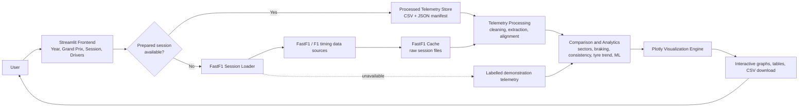
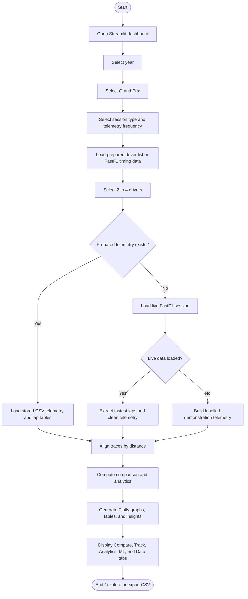

# F1 Telemetry Visualizer - College Presentation Content

## Project Identity

- **Short title:** F1 Telemetry Visualizer
- **Full title:** F1 Telemetry Visualizer: A Python-Based Platform for Interactive Formula 1 Lap Comparison and Analytics
- **Tagline:** Transforming Formula 1 session telemetry into interactive, explainable driver insights.

---

## Slide 1 - Title

### F1 Telemetry Visualizer

**A Python-Based Platform for Interactive Formula 1 Lap Comparison and Analytics**

- **Team name:** [Team Name]
- **College:** VIT Bhopal University
- **Department:** B.Tech Computer Science Engineering (AI & ML)
- **Guide:** [Guide Name]
- **Academic year:** 2025-26
- **Presented by:** Arsh Arun, Dhruv Singh, Vedansh Singh Tomar, Kanishka, Soumya Tandon,Avika    Singh

**Speaker notes:**

"Our project is an F1 telemetry analysis application built entirely in Python. It loads Formula 1 timing and car telemetry through FastF1, processes it into comparable lap data, and presents the results through an interactive Streamlit dashboard."

---

## Slide 2 - Problem Statement, Objective, and Scope

### Problem statement

Formula 1 telemetry is high-volume, multi-channel data containing speed, throttle, brake, gear, RPM, position, and timing information. Reading raw tables does not easily explain why one driver is faster than another. This project converts session data into aligned, interactive visualizations and concise analytical outputs so that students and motorsport enthusiasts can investigate lap performance without manually processing raw telemetry files.

### Objectives

- Load Formula 1 session timing and telemetry through FastF1.
- Cache and validate sessions before analysis.
- Extract each selected driver's fastest timed lap.
- Align laps by travelled distance rather than sample index.
- Compare speed, throttle, brake, gear, RPM, sector times, and delta time.
- Visualize racing lines and a speed heatmap using position coordinates.
- Calculate consistency, tyre-degradation trend, braking-zone, and corner-performance indicators.
- Apply K-Means lap clustering and Isolation Forest anomaly detection to lap-timing features.
- Provide CSV download, HTML comparison reports, and an online Streamlit interface.

### Project scope

- User-selectable year, Grand Prix, session type, telemetry frequency, and drivers.
- The dashboard supports up to four selected drivers; a single delta-time trace is meaningful for a two-driver comparison.
- Supports qualifying, race, sprint, sprint qualifying, and practice session labels accepted by the UI.
- Uses prepared local datasets first for reliable online delivery; otherwise it attempts live FastF1 loading.
- Includes a prepared 2024 Italian Grand Prix qualifying dataset with 20 drivers.

### Limitations

- Live FastF1 data depends on external timing sources and network availability.
- Only prepared sessions open without a live FastF1 download; other sessions can fall back to demonstration telemetry when data is unavailable.
- The present implementation does not contain race-strategy optimisation, pit-stop simulation, predictive lap-time modelling, driver scoring, or a trained deep-learning model.
- DRS is extracted and can be aligned, but the Streamlit dashboard does not currently display a dedicated DRS chart.
- Tyre degradation is a linear lap-time trend estimate, not a physical tyre model.

### Expected outcome

The outcome is a reproducible, deployable telemetry dashboard that turns selected F1 session data into visual driver comparisons, analytics tables, downloadable CSV files, and an optional HTML report.

**Speaker notes:**

"The aim is not to replace a Formula 1 team's proprietary engineering environment. It is an educational and analytical platform that makes real session telemetry understandable through a well-structured Python pipeline."

---

## Slide 3 - Hardware and Software Requirements

### Recommended development hardware

| Component | Recommended requirement | Reason |
|---|---|---|
| Processor | Dual-core 2 GHz or better | Handles data processing, Plotly rendering, and local Streamlit execution. |
| RAM | 4 GB minimum; 8 GB recommended | FastF1 session data and pandas DataFrames are held in memory. |
| Storage | 1 GB free space or more | Python environment, project files, reports, and FastF1 cache require local storage. |
| Internet | Stable broadband connection | Required for live FastF1 session downloads and Streamlit Cloud access. |
| Display | 1366 x 768 or higher | Supports the dashboard's side panel and multi-chart layout. |

For users of the deployed site, a modern browser and internet connection are sufficient. These are recommended operating conditions, not strict limits hard-coded into the source.

### Software requirements

| Software / library | Version or role | Use in this project |
|---|---|---|
| Python | Python 3.12 recommended; project supports Python 3.11+ | Core programming language. |
| Windows / Linux / macOS | Any Python-supported OS | Development or execution environment. |
| VS Code | Recommended editor | Source editing, terminal, testing, and Git integration. |
| Git and GitHub | Version control and repository hosting | Stores source code and triggers Streamlit Cloud redeployment. |
| Modern browser | Chrome, Edge, Firefox, etc. | Opens the Streamlit dashboard. |
| FastF1 | Direct runtime dependency | Downloads/caches F1 sessions and exposes laps, telemetry, position, weather, and event data. |
| pandas | Direct runtime dependency | Stores, cleans, filters, aggregates, exports, and displays tabular telemetry and lap data. |
| NumPy | Direct runtime dependency | Performs numerical interpolation, arrays, statistical calculations, and demonstration data generation. |
| Plotly | Direct runtime dependency | Creates interactive line charts, scatter charts, bars, speed heatmaps, and HTML report figures. |
| Streamlit | Direct runtime dependency | Builds the interactive dashboard, controls, tabs, metrics, downloads, and deployment interface. |
| scikit-learn | Direct runtime dependency | Provides K-Means clustering, StandardScaler, and Isolation Forest anomaly detection. |
| pytest | Development dependency | Runs the automated test suite. |
| Matplotlib | Listed dependency | Installed in the project but not directly imported by the current source code. |
| SciPy | Listed analytics dependency | Installed but not directly imported by the current source code. |
| Dash | Listed dashboard dependency | Installed but not used by the current Streamlit dashboard. |
| Rich and Typer | Listed dependencies | Installed but not used by the current CLI; the CLI uses Python `argparse`. |
| Requests | Not a direct project dependency/import | Not claimed as an implemented library; FastF1 may use its own dependencies internally. |

**Speaker notes:**

"We distinguish between libraries actively used by the code and packages merely listed in requirements for future expansion. The dashboard itself is implemented with Streamlit and Plotly, not Dash or Matplotlib."

---

## Slide 4 - Architecture Diagram

### Block explanation

| Block | Actual responsibility |
|---|---|
| User and Streamlit frontend | Collects year, Grand Prix, session type, frequency, and up to four drivers. |
| Processed Telemetry Store | Loads prebuilt CSV telemetry, lap data, corners, and JSON metadata. This is the preferred deployed path. |
| FastF1 Session Loader | Configures cache, obtains the requested FastF1 session, loads laps/telemetry/weather, and validates the result. |
| FastF1 cache | Stores repeated download data under `data/cache` for faster local analysis. |
| Telemetry processing | Cleans channels, adds numeric time columns, normalizes brake/DRS fields, selects fastest laps, and aligns data by distance. |
| Comparison and analytics | Produces sectors, delta time for a pair, driving insights, braking zones, corner summaries, consistency, tyre trend, clusters, and anomalies. |
| Plotly visualization | Produces speed, throttle, brake, gear, RPM, track, sector, lap-time, degradation, and clustering figures. |
| Demonstration telemetry | Keeps the interface usable if live FastF1 data cannot be loaded; the UI labels this source clearly. |

**Speaker notes:**

"The key engineering decision is separation of concerns. The UI does not contain FastF1-specific processing logic, and chart functions do not download data. This makes the system reusable from the dashboard and the command-line interface."

---

## Slide 5 - Process Flow

### Step explanation

1. The user chooses the session context from the sidebar.
2. The dashboard first checks whether a prepared dataset is available.
3. The user selects at least two drivers; the UI limits analysis to four selected drivers.
4. Prepared data is loaded immediately when available. Otherwise, FastF1 attempts a live load.
5. The extractor selects the fastest timed lap for each driver and prepares telemetry channels.
6. The aligner interpolates all laps onto a shared distance grid so sample positions are comparable.
7. Services build sectors, insights, and analytics tables.
8. Plotly charts and Streamlit tables present results; lap and sector tables can be downloaded as CSV.

**Speaker notes:**

"Distance alignment is essential. Two drivers do not record telemetry at identical sample positions, so comparing array index number 200 with array index number 200 would be misleading. We compare values at the same track distance instead."

---

## Slide 6 - Applications and Usability

| Application area | How the implemented project supports it |
|---|---|
| Formula 1 performance analysis | Fastest-lap overlays expose differences in speed, throttle, brake, gear, RPM, sectors, and track position. |
| Driver comparison | Two or more selected drivers can be compared; pairwise analysis provides a delta-time trace. |
| Race-strategy discussion | Lap-time evolution, tyre-life fields, stint grouping, and degradation slope provide descriptive inputs. The app does not optimise strategy or simulate pit stops. |
| Educational tool | Demonstrates data ingestion, time-series preparation, interpolation, analytics, ML, and interactive visualization in one project. |
| Motorsport research | Provides reusable structured CSV data and analysis modules for further experiments. |
| Sports analytics learning | Shows how raw event data becomes domain metrics, dashboards, and insight statements. |
| Data visualization learning | Demonstrates interactive Plotly line, scatter, bar, and coordinate-based track visualizations. |
| ML dataset exploration | Clusters valid laps using timing, sector, and tyre-life features; flags unusual sector-time patterns. |
| Future AI applications | The structured pipeline can later support prediction models, but no predictive AI is currently implemented. |

**Speaker notes:**

"The project is useful both as a motorsport learning tool and as a data-engineering case study. We are careful to describe strategy and AI prediction as future scope, not current functionality."

---

## Slide 7 - Contribution of Each Member

Replace placeholders with actual member names if your college requires individual attribution.

| Member | Role | Contribution | Hours |
|---|---|---|---:|
| Member 1 -Dhruv Singh     | Project Architecture and Backend | Designed project structure, configuration, domain models, and CLI workflows. | 18 |
| Member 2 -Vedansh Singh Tomar     | Data Ingestion | Implemented FastF1 session loading, cache configuration, validation, and prepared-session storage. | 18 |
| Member 3 -Avika Singh   | Telemetry Processing | Implemented cleaning, time conversion, fastest-lap extraction, and distance-based interpolation. | 18 |
| Member 4 -Arsh Arun  | Analytics and ML | Implemented sectors, braking zones, corner analysis, consistency, tyre trend, clustering, and anomaly detection. | 18 |
| Member 5 -Kanishka  | Frontend and Visualization | Built Streamlit controls/tabs and interactive Plotly telemetry, track, sector, and analytics charts. | 18 |
| Member 6 -Soumya Tandon  | Testing, Documentation, and Deployment | Wrote tests, prepared reports/CSV exports, maintained README/presentation, GitHub workflow, and Streamlit Cloud deployment. | 18 |

**Speaker notes:**

"The work is divided by modules rather than vague activities. Each contribution maps to visible source-code layers and has balanced estimated effort across six members."

---

## Slide 8 - References

Use the following IEEE-style references in the final presentation.

1. FastF1, "FastF1 Documentation," 2026. [Online]. Available: https://docs.fastf1.dev/. Accessed: Jul. 31, 2026.
2. Formula 1, "F1 - The Official Home of Formula 1 Racing," 2026. [Online]. Available: https://www.formula1.com/. Accessed: Jul. 31, 2026.
3. Python Software Foundation, "Python 3 Documentation," 2026. [Online]. Available: https://docs.python.org/3/. Accessed: Jul. 31, 2026.
4. Streamlit, "Streamlit Documentation," 2026. [Online]. Available: https://docs.streamlit.io/. Accessed: Jul. 31, 2026.
5. pandas development team, "pandas Documentation," 2026. [Online]. Available: https://pandas.pydata.org/docs/. Accessed: Jul. 31, 2026.
6. NumPy Developers, "NumPy Documentation," 2026. [Online]. Available: https://numpy.org/doc/stable/. Accessed: Jul. 31, 2026.
7. Matplotlib Development Team, "Matplotlib Documentation," 2026. [Online]. Available: https://matplotlib.org/stable/. Accessed: Jul. 31, 2026.
8. Plotly Technologies Inc., "Plotly Python Graphing Library," 2026. [Online]. Available: https://plotly.com/python/. Accessed: Jul. 31, 2026.
9. scikit-learn Developers, "scikit-learn Documentation," 2026. [Online]. Available: https://scikit-learn.org/stable/. Accessed: Jul. 31, 2026.
10. A. Arsh, "F1 Telemetry Visualizer," GitHub repository, 2026. [Online]. Available: https://github.com/aarshx-24/F1-Telemetry-Visualizer. Accessed: Jul. 31, 2026.

No research paper is directly cited or implemented in the present source code. Add a paper only if it is genuinely read and used in your final report.

**Speaker notes:**

"Our main primary sources are official software documentation and the actual project repository. We avoid claiming research-paper implementation where none exists."

---

## Project Overview (approximately 150 words)

F1 Telemetry Visualizer is a Python-based analytics platform that helps users compare Formula 1 laps through interactive telemetry visualizations. The system uses FastF1 to load session timing, car telemetry, position data, weather, and event information. A modular architecture separates data ingestion, telemetry cleaning, fastest-lap extraction, distance-based alignment, analytics, visualization, and the Streamlit user interface. Users select a year, Grand Prix, session type, telemetry frequency, and drivers. The dashboard then presents speed, throttle, brake, gear, RPM, sector, delta-time, racing-line, and speed-heatmap views. It also calculates braking zones, corner performance, lap consistency, and a linear tyre-degradation trend. The ML section groups suitable laps with K-Means and identifies unusual sector-time patterns with Isolation Forest. For deployment reliability, prepared FastF1 datasets are stored as CSV and JSON files and loaded before attempting live data. The project also provides command-line session summaries, CSV export, and interactive HTML comparison reports.

## Elevator Pitch (30 seconds)

"F1 Telemetry Visualizer turns complex Formula 1 session data into an interactive Python dashboard. Instead of reading raw telemetry tables, a user can select drivers and immediately compare their fastest laps through speed, braking, throttle, sector, track, and delta-time views. The platform uses FastF1, pandas, Plotly, Streamlit, and basic machine-learning techniques. Its modular architecture also stores prepared sessions locally, making the deployed dashboard more reliable when live timing sources are slow."

## Key Features

- FastF1 session loading, validation, and caching.
- Prepared telemetry store for reliable deployed sessions.
- Fastest-lap extraction and distance-based telemetry interpolation.
- Interactive speed, throttle, brake, gear, RPM, delta-time, sector, track, and heatmap charts.
- Braking-zone, corner, consistency, and tyre-trend analysis.
- K-Means clustering and Isolation Forest anomaly detection.
- CSV downloads, HTML comparison reports, CLI commands, and automated tests.

## Advantages

- Modular Python architecture keeps ingestion, processing, analytics, charts, and UI separate.
- Uses real F1 session data when FastF1 is available.
- Prepared datasets reduce reliance on live upstream services.
- Interactive charts make performance differences easier to understand.
- Works as a practical AI/ML and data-visualization learning project.
- Provides a safe, labelled demonstration-data fallback instead of showing a blank dashboard.

## Challenges Faced

- FastF1 live data can fail because it depends on network access and external timing sources.
- Different drivers have different telemetry sample positions, requiring interpolation onto a common distance grid.
- Session data contains missing values, timedeltas, boolean brake values, and DRS states that must be normalized.
- A public Streamlit deployment needs reliable data even after its temporary cache is cleared.
- Some analytics require sufficient clean lap data; the code returns empty results when the dataset is too small instead of producing misleading output.

## Future Scope

- Add prepared datasets for more races and seasons.
- Add a dedicated DRS visualization to the dashboard.
- Add lap and stint selectors instead of analysing only fastest laps.
- Implement race-strategy simulation using tyre, pit-stop, and safety-car assumptions.
- Train and evaluate predictive models for lap time, tyre degradation, or anomaly classification.
- Add user accounts, saved comparisons, report templates, and external storage for larger datasets.
- Add testing on a larger set of sessions and automatic scheduled dataset preparation.

## Conclusion

F1 Telemetry Visualizer demonstrates an end-to-end data-engineering and analytics workflow for motorsport data. The project converts FastF1 session data into clean, aligned telemetry and presents it through a deployable interactive dashboard. Its value lies in combining practical software architecture with understandable racing analysis. The current implementation delivers comparison, visualization, descriptive analytics, simple unsupervised ML, reporting, and reliable prepared-session loading while leaving prediction and strategy optimisation as clear future work.

## Acknowledgement

We express our sincere gratitude to our project guide, department faculty, and college for their guidance and support. We also acknowledge the FastF1, Python, Streamlit, Plotly, pandas, NumPy, and scikit-learn open-source communities for the documentation and tools that made this educational project possible. Finally, we thank our team members for their collaboration in designing, implementing, testing, documenting, and presenting the project.

## Demo Script for Presenters

1. Open the deployed Streamlit application.
2. In the sidebar, select **2024**, **Italian Grand Prix**, and **Q**.
3. Choose **VER** and **LEC**; explain that this prepared session loads from stored FastF1-derived data.
4. Show the lap-time metric cards and explain that the system compares each driver's fastest timed lap.
5. In **Compare**, point out speed, throttle, brake, gear, RPM, delta-time, and sector charts. Explain that the traces share a distance axis.
6. In **Track**, show the speed heatmap and racing-line overlay.
7. In **Analytics**, show consistency, tyre trend, braking zones, and corner-performance tables.
8. In **ML**, explain the clustered-lap scatter plot and anomaly table; clarify that these are unsupervised analytics, not race predictions.
9. In **Data**, download lap or sector data as CSV.
10. Close by showing that the project can also generate an HTML report or prepare sessions through CLI commands.

## Viva Questions and Answers

1. **What is telemetry in Formula 1?**  
   Telemetry is time-series data describing car behaviour, such as speed, throttle, braking, RPM, gear, DRS, and position.

2. **Why is distance-based alignment used?**  
   Drivers record samples at different positions and rates. Interpolating both laps onto one distance grid allows a fair comparison at the same point on the circuit.

3. **How is delta time calculated?**  
   For two aligned laps, the application computes comparison-driver time minus reference-driver time at each distance point.

4. **Which data source is used?**  
   The project uses FastF1 for live Formula 1 session data and can use prepared FastF1-derived CSV files for reliable deployment.

5. **Why is caching required?**  
   FastF1 session downloads can be large and slow. Caching avoids repeated downloads during local analysis.

6. **What happens if FastF1 cannot load data?**  
   The dashboard uses prepared data if available. Otherwise, it shows clearly labelled deterministic demonstration telemetry so the interface remains usable.

7. **How is the fastest lap selected?**  
   The extractor filters timed laps for each driver and selects the fastest valid lap, using FastF1 helpers when available.

8. **Which telemetry channels are visualized in the dashboard?**  
   Speed, throttle, brake, gear, RPM, delta time, sectors, track position, and speed heatmaps are displayed.

9. **Is DRS displayed in the dashboard?**  
   DRS is included in the processing schema and alignment data, but there is no dedicated DRS plot in the current Streamlit UI.

10. **How is tyre degradation estimated?**  
    The project fits a simple linear trend to lap time against lap number within each driver-stint-compound group. The slope is reported as degradation per lap.

11. **How are braking zones detected?**  
    Consecutive braking samples are grouped, short groups are discarded, and entry speed, minimum speed, distance, duration, and speed drop per metre are calculated.

12. **What does corner-performance analysis measure?**  
    Around each circuit corner distance, it estimates entry speed, minimum/apex speed, and exit speed from a local telemetry window.

13. **What machine-learning methods are used?**  
    K-Means groups laps using timing, sector, and tyre-life features; Isolation Forest marks unusual sector-time patterns.

14. **Is this a predictive AI system?**  
    No. The implemented ML features are unsupervised clustering and anomaly detection, not prediction.

15. **Why use Streamlit?**  
    Streamlit allows Python-based interactive controls, tabs, charts, tables, downloads, and straightforward cloud deployment.

16. **Why use Plotly instead of only Matplotlib?**  
    Plotly supplies interactive hover, zoom, legends, and browser-friendly figures. Matplotlib is installed but is not directly used in the current source.

17. **How are processed sessions stored?**  
    The store saves a JSON manifest plus CSV files for lap tables, circuit corners, and per-driver telemetry.

18. **How many drivers can be selected?**  
    The dashboard limits the interactive selection to four drivers; two-driver selections provide the clearest delta-time comparison.

19. **What testing is included?**  
    The project has pytest tests for configuration, telemetry cleaning/alignment, analytics, and processed-store round trips.

20. **What is the main limitation of public deployment?**  
    Live FastF1 availability depends on external services, so only sessions prepared and committed with the app are guaranteed to load without a live download.
